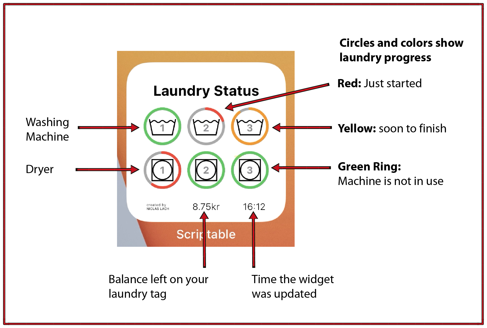

# CBS Laundry Widget

This project creates an iOS widget to **monitor washing machines and dryers** in all CBS dorms using the [Scriptable App](https://scriptable.app).  
Moreover, the widget lets users check their **current balance of their laundry tag**.  

### Features
- See the status of laundry machines and dryers
- Colour encoding quickly shows the status of the machines
  - Red: *In use*
  - Yellow: *Soon to finish*
  - Green: *Machine ready / finished*
- Rings show progress of each machine
- Display current balance of your laundr tag

All features are also explained in the graphic below:

 

## Install the Widget

1. [Download Scriptable on the iOS App Store](https://apps.apple.com/us/app/scriptable/id1405459188?uo=4)
2. Create a new script inside Scriptable.
3. Rename the script by clicking on its name in the top.
  *(This step is not necessary but it is good practice. :stuck_out_tongue_winking_eye:)*
4. Copy the code of [CBSLaundryWidget.js](https://github.com/Niclaslach/CBSLaundryWidget/blob/main/CBSLaundryWidget.js) into the empty script.
5. Change variable *dorm* to your dorm (in quotes, spelling important). Options are:  
   - Porcelaenshaven
   - Holger Danske Kollegiet
   - Nimbusparken
   - Kathrine kollegiet
    

6. Add the Scriptable widget to your homescreen (hold on an app until it shakes and click the "+" button on the upper left corner).  
The suggested size is small.
7. Click on the newly created widget and select the newly created script.  

8. **Optional:** Under Parameter enter your username and password to see your current Saniva balance.  
The format should be *\<username\>;\<password\>*  
*Example: 123;0000*
